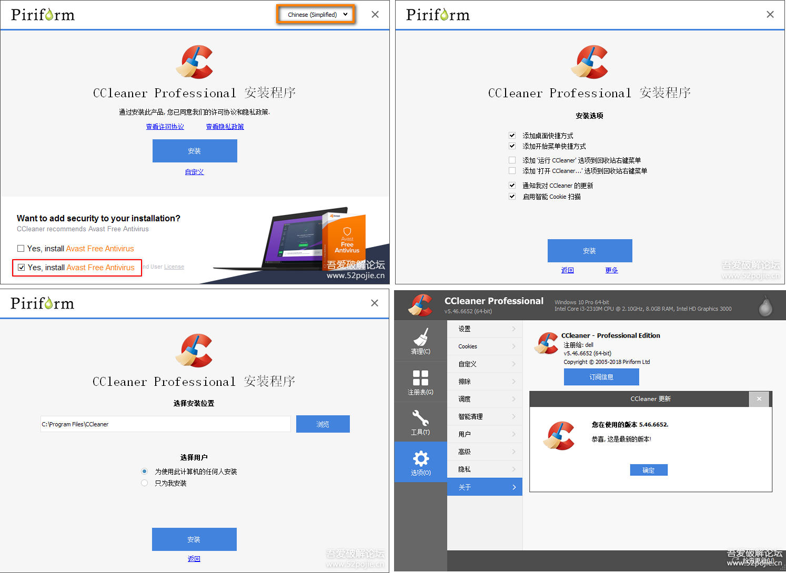

> 来源：[Windows【9月21日更新】系统清理优化软件 CCleaner v5.47.6716专业版+商业版+技术员版 ](https://www.52pojie.cn/thread-791304-1-1.html "https://www.52pojie.cn/thread-791304-1-1.html")


CCleaner是一款免费的系统优化和隐私保护工具。CCleaner主要用来清除Windows系统不再使用的垃圾文件，以腾出更多硬盘空间。它的另一大功能是清除使用者的上网记录。CCleaner的体积小，运行速度极快，可以对文件夹、历史记录、回收站等进行垃圾清理，并可对注册表进行垃圾项扫描、清理。附带软件卸载功能。 同时支持IE、Firefox。支持包括简体中文在内的26国语言界面！




由于之前5.45发布，强制捆绑Avast杀毒软件，被网友强烈Diss，所以这个版本添加了选项来决定是否安装Avast，不过默认是勾选的，在安装之前一定要取消勾选之后再进行下一步安装。


安装方法:


1、首先断开网络连接

2、安装CCleaner

3、将对应版本的 `branding.dll` 文件拷贝到CCleaner的安装目录下

4、打开CCleaner并使用注册机进行注册  (点击 generate )


```
文件说明：

ccsetup547pro.exe			// 5.47 专业版 **推荐
ccsetup547_be.exe			// 5.47 商业版
ccsetup547_te.exe			// 5.47 技术员版
Piriform.All.Editions.Keymaker.branding.rar		// branding.dll文件及 注册机cr-piriform.exe
```


下载地址：

9月28日补发链接

5.46+5.47版本

链接: https://pan.baidu.com/s/1buF9I5sH0_mhi9zVMIrWRg    提取码: th7f
